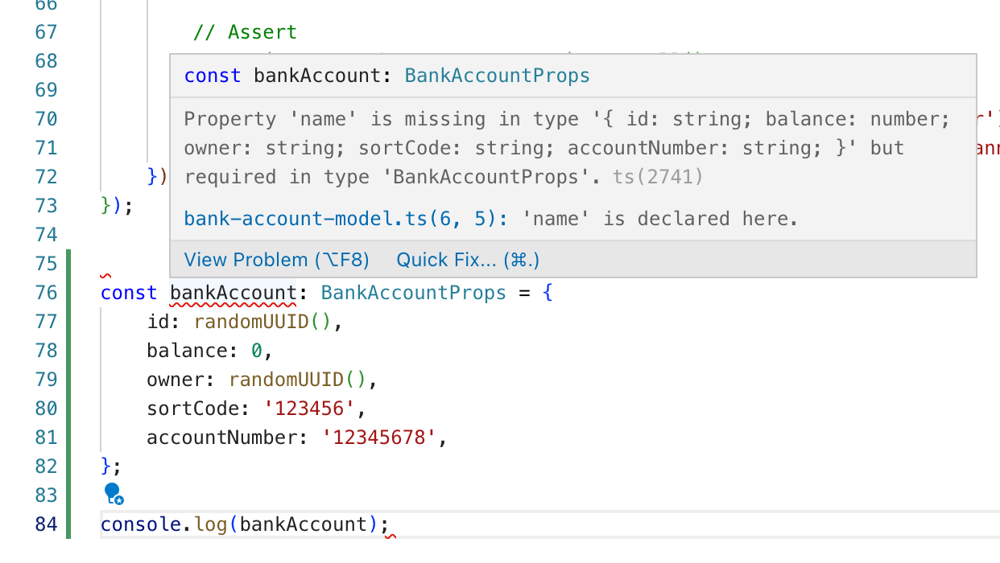
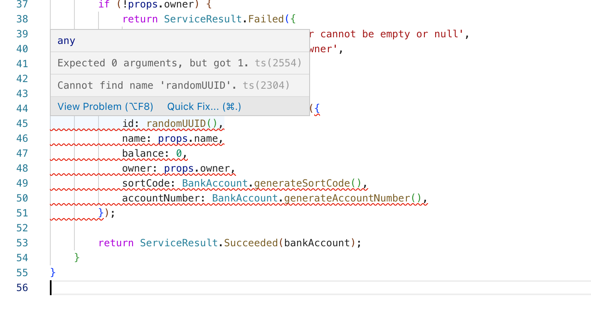
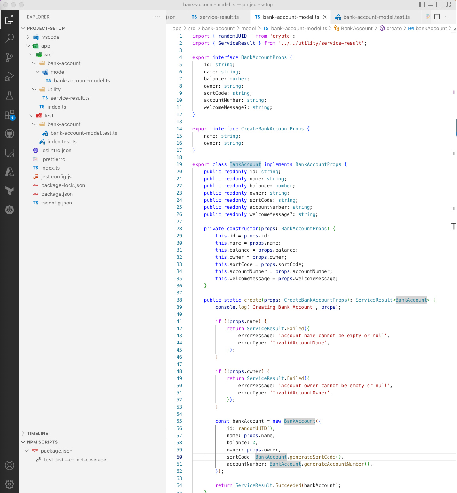

# Designing Domain Model

In this module we will design the domain model of the application. We will also cover topics and patterns like:

- Builder Pattern
- Private Constructors
- Injection Through Props
- Utility Types
- Service Result Pattern

Our application will be a simple Bank Account API that supports following functionality:

- Create New Bank Account
- Update Personal Details
- Deposit and Withdraw Money
- Sort Code to be 6 digits
- Account Number to be 8 digits
- For personalization purposes, a welcome message can be attached (optional)

In Domain Driven Design, a Model captures the core business responsibilities and encapsulates it for immutability. This provides a loosely coupled implementation opportunity and great testability.

To build such domain model using Typescript, we will use different features of the language such as Interfaces, Utility Types, Constructors etc.

## Domain Properties

When we think about a simple bank account with above requirements, we can design a simple definition like following:

```typescript
export interface BankAccountProps {
    id: string;
    name: string;
    balance: number;
    owner: string;
    sortCode: string;
    accountNumber: string;
    welcomeMessage?: string;
}
```

For the simplicity, we can use `string` for most of the properties. As `welcomeMessage` is optional per requirements, we set it an **optional parameter**. The other parameters in this interface are all **required parameters**. This means, any object implementing this interface has to implement these parameters or any object created with this interface as its type, all required parameters have to be provided.

The following error will be shown on the VSCode editor. This error is driven by the typechecking system Typescript provides. Combination of ESLint, Prettier and Typescript, a developer will be immediately made aware of what is required and what is missing.



Although this interface reflects the requirements, the data with just using the interface will be not immutable and could cause serious production issues. Following code is unacceptable in a real world bank application.

```typescript
// Creates a new bank account
const bankAccount: BankAccountProps = {
    id: randomUUID(),
    balance: 0,
    name: 'Test Account',
    owner: randomUUID(),
    sortCode: '123456',
    accountNumber: '12345678',
};

// Changes the owner of the account
bankAccount.owner = 'Someone Else';

// Deposits arbitrary amount of money
bankAccount.balance = 1_000_000;
```

Instead of this catastrophic implementation, we can introduce some Object Oriented Design principles and especially encapsulation. This would improve the data to become immutable, close for modification and securely implements the business requirements.

## Builder Pattern

This pattern has been made famous in Java world and made its way to other languages and frameworks by the value it creates. Simply, this pattern does not allow creation of a new object by making its constructor private and only exposing public static methods. These methods make sure the data is validated before turning into an object.

To achieve this in Typescript, first we need to identify what can be allowed for creating a bank account. In our implementation we will only allow setting an owner and a name for the bank account. Other details like sort code, account number and other details should be dictated by the domain model.

An interface for creating a new bank account can be designed simply:

```typescript
export interface CreateBankAccountProps {
    name: string;
    owner: string;
}
```

If we can use this interface to create a new bank account (applying Interface Segregation), by default we are mitigating risk of a bad actor in the system modifying the account of a customer. An implementation for this interface could be:

```typescript
    public static create(props: CreateBankAccountProps): BankAccount {
        console.log('Creating Bank Account', props);

        if (!props.name) {
            throw new Error('Account name cannot be empty or null');
        }

        if (!props.owner) {
            throw new Error('Account owner cannot be empty or null');
        }

        const bankAccount = new BankAccount({
            id: randomUUID(),
            name: props.name,
            balance: 0,
            owner: props.owner,
            sortCode: BankAccount.generateSortCode(),
            accountNumber: BankAccount.generateAccountNumber(),
        });

        return ServiceResult.Succeeded(bankAccount);
    }
```

As you can see, we are creating a `new BankAccount({....})` above. To make sure this can be only done inside the domain model and `BankAccount` is immutable, we can introduce a `private` constructor.

Also, for the integrity of our bank accounts, we will only allow customers to change their account name or welcome message. We are going to expose this functionality with another interface:

```typescript
export interface UpdateBankAccountProps {
    name?: string;
    welcomeMessage?: string;
}
```

This is how we can implement it in Typescript:

```typescript
export class BankAccount {
    public readonly id: string;
    public readonly name: string;
    public readonly balance: number;
    public readonly owner: string;
    public readonly sortCode: string;
    public readonly accountNumber: string;
    public readonly welcomeMessage?: string;

    private constructor(props: BankAccountProps) {
        this.id = props.id;
        this.name = props.name;
        this.balance = props.balance;
        this.owner = props.owner;
        this.sortCode = props.sortCode;
        this.accountNumber = props.accountNumber;
        this.welcomeMessage = props.welcomeMessage;
    }

    public static create(props: CreateBankAccountProps): ServiceResult<BankAccount> {
        console.log('Creating Bank Account', props);

        if (!props.name) {
            return ServiceResult.Failed({
                errorMessage: 'Account name cannot be empty or null',
                errorType: 'InvalidAccountName',
            });
        }

        if (!props.owner) {
            return ServiceResult.Failed({
                errorMessage: 'Account owner cannot be empty or null',
                errorType: 'InvalidAccountOwner',
            });
        }

        const bankAccount = new BankAccount({
            id: randomUUID(),
            name: props.name,
            balance: 0,
            owner: props.owner,
            sortCode: BankAccount.generateSortCode(),
            accountNumber: BankAccount.generateAccountNumber(),
        });

        return ServiceResult.Succeeded(bankAccount);
    }

    private static generateSortCode(): string {
        const sortCode = Math.floor(100_000 + Math.random() * 900_000).toString();
        console.log('Generated Sort Code', sortCode);
        return sortCode;
    }

    private static generateAccountNumber(): string {
        const accountNumber = Math.floor(1_000_0000 + Math.random() * 90_000_000).toString();
        console.log('Generated Account Number', accountNumber);
        return accountNumber;
    }

    public static update(bankAccount: BankAccount, props: UpdateBankAccountProps): ServiceResult<BankAccount> {
        console.log('Updating Bank Account', bankAccount, props);

        const updatedBankAccount = new BankAccount({
            id: bankAccount.id,
            name: props.name ?? bankAccount.name,
            balance: bankAccount.balance,
            owner: bankAccount.owner,
            sortCode: bankAccount.sortCode,
            accountNumber: bankAccount.accountNumber,
            welcomeMessage: props.welcomeMessage ?? bankAccount.welcomeMessage,
        });

        return ServiceResult.Succeeded(updatedBankAccount);
    }
}
```

### Should Exceptions Be Exceptional?

The answer is **YES**.

We need to avoid throwing exceptions by using `new Error("Something gone wrong")` and instead return a success or failure to the consumer of our class. This helps observability in production by making sure program control flow handles all cases and only edge cases or dependencies or infrastructure level issues are thrown as exceptions.

```typescript
export interface ErrorResponse {
    errorMessage: string;
    errorType: string;
    details?: unknown;
}

export class ServiceResult<T> {
    public readonly success: boolean;
    public readonly failure: boolean;
    public readonly statusCode: number;
    public readonly status: string;
    public readonly content: T | null;
    public readonly error: ErrorResponse | null;

    private constructor(content: T | null, error: ErrorResponse | null, success: boolean) {
        this.content = content;
        this.error = error;
        this.success = success;
        this.failure = !success;
        this.statusCode = success ? 200 : 400;
        this.status = success ? 'Success' : 'Error';
    }

    public static Succeeded<T>(content: T): ServiceResult<T> {
        return new ServiceResult<T>(content, null, true);
    }

    public static Failed<T>(error: ErrorResponse): ServiceResult<T> {
        return new ServiceResult<T>(null, error, false);
    }
}
```

As you can see above, Typescript also supports generic programming. Without really concerning what is sent and what is returned, `public static Succeeded<T>(content: T): ServiceResult<T>` method signature implements the Result Pattern using a `private constructor`.

The usage of this class for errors will be:

```typescript
if (!props.name) {

    const error: ErrorResponse = {
        errorMessage: 'Account name cannot be empty or null',
        errorType: 'InvalidAccountName',
    };

    return ServiceResult.Failed(error);
}
```

Or simply, you can create `error` object while calling the method:

```typescript
if (!props.name) {
    return ServiceResult.Failed({
        errorMessage: 'Account name cannot be empty or null',
        errorType: 'InvalidAccountName',
    });
}
```

## ✅ Checkpoint: Let's Build Domain Model

To implement a Result Pattern in typescript, create a new `utility` folder under `src` and paste the contents of the following to `service-result.ts`

```typescript
export interface ErrorResponse {
    errorMessage: string;
    errorType: string;
    details?: unknown;
}

export class ServiceResult<T> {
    public readonly success: boolean;
    public readonly failure: boolean;
    public readonly statusCode: number;
    public readonly status: string;
    public readonly content: T | null;
    public readonly error: ErrorResponse | null;

    private constructor(content: T | null, error: ErrorResponse | null, success: boolean) {
        this.content = content;
        this.error = error;
        this.success = success;
        this.failure = !success;
        this.statusCode = success ? 200 : 400;
        this.status = success ? 'Success' : 'Error';
    }

    public static Succeeded<T>(content: T): ServiceResult<T> {
        return new ServiceResult<T>(content, null, true);
    }

    public static Failed<T>(error: ErrorResponse): ServiceResult<T> {
        return new ServiceResult<T>(null, error, false);
    }
}
```

Let's create the domain model and implement it using TDD.

First, create `bank-account-model.ts` at `app/src/bank-account/model`:

```typescript
import { ServiceResult } from '../../utility/service-result';

export interface BankAccountProps {
    id: string;
    name: string;
    balance: number;
    owner: string;
    sortCode: string;
    accountNumber: string;
    welcomeMessage?: string;
}

export interface CreateBankAccountProps {
    name: string;
    owner: string;
}

export class BankAccount implements BankAccountProps {
    public readonly id: string;
    public readonly name: string;
    public readonly balance: number;
    public readonly owner: string;
    public readonly sortCode: string;
    public readonly accountNumber: string;
    public readonly welcomeMessage?: string;

    public static create(props: CreateBankAccountProps): ServiceResult<BankAccount> {
        throw new Error('Not Implemented');
    }
}
```

As you can see, we have `BankAccountProps` interface implemented by `BankAccount`. There are couple of benefits from this:

1. `BankAccountProps` abstracts the inner details of `BankAccount` and creates a contract between the domain model and the outer layers.
2. Implementing an interface enables type safety between your model and the consumers.

Also, to improve the immutability of data, we implemented the interface using `public readonly` properties. This avoids the dynamic language features of Javascript to mutate data on the fly.

The above will enable us to write our tests according to the requirements.  
Let's build some tests.

Create `bank-account-model.test.ts` under `app/test/bank-account/` with following content:

```typescript
import { randomUUID } from 'crypto';
import { BankAccount, CreateBankAccountProps } from '../../src/bank-account/model/bank-account-model';

describe('Bank Account Model', () => {
    test('Should Create', () => {
        // Arrange
        const owner = randomUUID();
        const accountName = 'Test Account';

        const props: CreateBankAccountProps = {
            name: accountName,
            owner,
        };

        // Act
        const createBankAccount = BankAccount.create(props);
        const bankAccount = createBankAccount.content;

        // Assert
        expect(bankAccount).not.toBeNull();
        expect(bankAccount?.balance).toBe(0);
        expect(bankAccount?.owner).toBe(owner);
        expect(bankAccount?.accountNumber).not.toBeNull();
        expect(bankAccount?.sortCode).not.toBeNull();
        expect(bankAccount?.name).toBe(accountName);
        expect(bankAccount?.welcomeMessage).toBeUndefined();
        expect(bankAccount?.id).not.toBeNull();
        expect(bankAccount?.sortCode.length).toBe(6);
        expect(bankAccount?.accountNumber.length).toBe(8);
    });

    test('Should Fail To Create With Empty Account Name', () => {
        // Arrange
        const owner = randomUUID();
        const accountName = null;

        const props: CreateBankAccountProps = {
            // @ts-ignore
            name: accountName,
            owner,
        };

        // Act
        const createBankAccount = BankAccount.create(props);

        // Assert
        expect(createBankAccount.content).toBeNull();
        expect(createBankAccount.error).not.toBeNull();
        expect(createBankAccount.error?.errorType).toBe('InvalidAccountName');
        expect(createBankAccount.error?.errorMessage).toBe('Account name cannot be empty or null');
    });

    test('Should Fail To Create With Empty Account Owner', () => {
        // Arrange
        const owner = null;
        const accountName = 'Test Account';

        const props: CreateBankAccountProps = {
            name: accountName,
            // @ts-ignore
            owner,
        };

        // Act
        const createBankAccount = BankAccount.create(props);

        // Assert
        expect(createBankAccount.content).toBeNull();
        expect(createBankAccount.error).not.toBeNull();
        expect(createBankAccount.error?.errorType).toBe('InvalidAccountOwner');
        expect(createBankAccount.error?.errorMessage).toBe('Account owner cannot be empty or null');
    });

    test('Should Update Bank Account Name', () => {
        // Arrange
        const owner = randomUUID();
        const accountName = 'Test Account';

        const props: CreateBankAccountProps = {
            name: accountName,
            owner,
        };

        const createBankAccount = BankAccount.create(props);
        const bankAccount = createBankAccount.content!;

        const newAccountProps: UpdateBankAccountProps = {
            name: 'New Account Name',
        };

        // Act
        const updateBankAccount = BankAccount.update(bankAccount, newAccountProps);

        // Assert
        expect(updateBankAccount.content).not.toBeNull();
        expect(updateBankAccount.content?.name).toBe(newAccountProps.name);
        expect(updateBankAccount.content?.welcomeMessage).toBeUndefined();
    });

    test('Should Update Bank Account Welcome Message', () => {
        // Arrange
        const owner = randomUUID();
        const accountName = 'Test Account';

        const props: CreateBankAccountProps = {
            name: accountName,
            owner,
        };

        const createBankAccount = BankAccount.create(props);
        const bankAccount = createBankAccount.content!;

        const newAccountProps: UpdateBankAccountProps = {
            welcomeMessage: 'Welcome to my account',
        };

        // Act
        const updateBankAccount = BankAccount.update(bankAccount, newAccountProps);

        // Assert
        expect(updateBankAccount.content).not.toBeNull();
        expect(updateBankAccount.content?.name).toBe(accountName);
        expect(updateBankAccount.content?.welcomeMessage).toBe(newAccountProps.welcomeMessage);
    });
});
```

The above tests implements all requirements from the context:

- Checking bank account is created with 0 balance
- Checking sort code and account number are created with correct format (character lengths)
- Checking if correct errors are thrown

**A note on `// @ts-ignore`**: This is telling the Typescript compiler to ignore the next line. This is not encouraged to be used in production code. However for testing purposes, to create incorrect inputs or corrupted data, we can use it with combination of dynamism at Javascript.

Following code cannot compile as `CreateBankAccountProps` requires both name and owner:

```typescript
const props: CreateBankAccountProps = {
    owner,
};
```

However, the following can still compile but can cause huge runtime issues (bugs, exceptions):

```typescript
const props: CreateBankAccountProps = {
    name: accountName,
    // @ts-ignore
    owner,
};
```

When you run tests either on terminal using `npm run test`, or from the UI using `NPM Scripts`, you will see tests failing:

```sh
Executing task: npm run test 


> typescript-starter@1.0.0 test
> jest --collect-coverage

 PASS  app/test/index.test.ts
 FAIL  app/test/bank-account/bank-account-model.test.ts
  ● Bank Account Model › Should Create

    Not Implemented

      26 |
      27 |     public static create(props: CreateBankAccountProps): ServiceResult<BankAccount> {
    > 28 |         throw new Error('Not Implemented');
         |               ^
      29 |     }
      30 | }
      31 |

      at Function.create (app/src/bank-account/model/bank-account-model.ts:28:15)
      at Object.<anonymous> (app/test/bank-account/bank-account-model.test.ts:16:47)

  ● Bank Account Model › Should Fail To Create With Empty Account Name

    Not Implemented

      26 |
      27 |     public static create(props: CreateBankAccountProps): ServiceResult<BankAccount> {
    > 28 |         throw new Error('Not Implemented');
         |               ^
      29 |     }
      30 | }
      31 |

      at Function.create (app/src/bank-account/model/bank-account-model.ts:28:15)
      at Object.<anonymous> (app/test/bank-account/bank-account-model.test.ts:44:47)

  ● Bank Account Model › Should Fail To Create With Empty Account Owner

    Not Implemented

      26 |
      27 |     public static create(props: CreateBankAccountProps): ServiceResult<BankAccount> {
    > 28 |         throw new Error('Not Implemented');
         |               ^
      29 |     }
      30 | }
      31 |

      at Function.create (app/src/bank-account/model/bank-account-model.ts:28:15)
      at Object.<anonymous> (app/test/bank-account/bank-account-model.test.ts:65:47)

------------------------|---------|----------|---------|---------|-------------------
File                    | % Stmts | % Branch | % Funcs | % Lines | Uncovered Line #s 
------------------------|---------|----------|---------|---------|-------------------
All files               |     100 |      100 |     100 |     100 |                   
 src                    |     100 |      100 |     100 |     100 |                   
  index.ts              |     100 |      100 |     100 |     100 |                   
 src/bank-account/model |     100 |      100 |     100 |     100 |                   
  bank-account-model.ts |     100 |      100 |     100 |     100 |                   
------------------------|---------|----------|---------|---------|-------------------
Test Suites: 1 failed, 1 passed, 2 total
Tests:       3 failed, 1 passed, 4 total
Snapshots:   0 total
Time:        1.898 s, estimated 3 s
Ran all test suites.
```

Let's implement the business logic, first starting with errors and purposefully return a failure for this stage. Add following to `create` method of `bank-account-model.ts`:

```typescript
if (!props.name) {
    return ServiceResult.Failed({
        errorMessage: 'Account name cannot be empty or null',
        errorType: 'InvalidAccountName',
    });
}

if (!props.owner) {
    return ServiceResult.Failed({
        errorMessage: 'Account owner cannot be empty or null',
        errorType: 'InvalidAccountOwner',
    });
}

return ServiceResult.Failed({
    errorMessage: 'The account is not implemented',
    errorType: 'InvalidImplementation',
});
```

Now running tests will give a better test result but still failing 1 test:

```sh
Test Suites: 1 failed, 1 passed, 2 total
Tests:       1 failed, 3 passed, 4 total
Snapshots:   0 total
Time:        3.214 s
```

Let's build the happy path and see our tests all passing. Simply putting below lines will not work:

```typescript
const bankAccount = new BankAccount({
    id: randomUUID(),
    name: props.name,
    balance: 0,
    owner: props.owner,
    sortCode: BankAccount.generateSortCode(),
    accountNumber: BankAccount.generateAccountNumber(),
});

return ServiceResult.Succeeded(bankAccount);
```



This error is due to `BankAccount` not having any `constructor`. This means you can only create `new BankAccount()`. Because your properties are `public readonly`, you cannot set them after creating the object. Also, remember that we are trying to avoid mutability in data, we need to provide a single point to create the data.

To achieve this, add following `constructor` to `bank-account-model.ts`:

```typescript
import { randomUUID } from 'crypto';

//////

export class BankAccount implements BankAccountProps {
    ///////

    private constructor(props: BankAccountProps) {
        this.id = props.id;
        this.name = props.name;
        this.balance = props.balance;
        this.owner = props.owner;
        this.sortCode = props.sortCode;
        this.accountNumber = props.accountNumber;
        this.welcomeMessage = props.welcomeMessage;
    }


    public static create(props: CreateBankAccountProps): ServiceResult<BankAccount> {
        ////////
    }

    private static generateSortCode(): string {
        const sortCode = Math.floor(100_000 + Math.random() * 900_000).toString();
        console.log('Generated Sort Code', sortCode);
        return sortCode;
    }

    private static generateAccountNumber(): string {
        const accountNumber = Math.floor(1_000_0000 + Math.random() * 90_000_000).toString();
        console.log('Generated Account Number', accountNumber);
        return accountNumber;
    }

}
```

🎉 Now running tests should all pass:

```typescript
---------------|---------|----------|---------|---------|-------------------
File           | % Stmts | % Branch | % Funcs | % Lines | Uncovered Line #s 
---------------|---------|----------|---------|---------|-------------------
All files      |     100 |      100 |     100 |     100 |                   
 src           |     100 |      100 |     100 |     100 |                   
  index.ts     |     100 |      100 |     100 |     100 |                   
 ...ount/model |     100 |      100 |     100 |     100 |                   
  ...-model.ts |     100 |      100 |     100 |     100 |                   
 src/utility   |     100 |      100 |     100 |     100 |                   
  ...result.ts |     100 |      100 |     100 |     100 |                   
---------------|---------|----------|---------|---------|-------------------

Test Suites: 2 passed, 2 total
Tests:       4 passed, 4 total
Snapshots:   0 total
Time:        2.091 s
Ran all test suites.
```

The final `bank-account-model.ts` is:

```typescript
import { randomUUID } from 'crypto';
import { ServiceResult } from '../../utility/service-result';

export interface BankAccountProps {
    id: string;
    name: string;
    balance: number;
    owner: string;
    sortCode: string;
    accountNumber: string;
    welcomeMessage?: string;
}

export interface CreateBankAccountProps {
    name: string;
    owner: string;
}

export class BankAccount implements BankAccountProps {
    public readonly id: string;
    public readonly name: string;
    public readonly balance: number;
    public readonly owner: string;
    public readonly sortCode: string;
    public readonly accountNumber: string;
    public readonly welcomeMessage?: string;

    private constructor(props: BankAccountProps) {
        this.id = props.id;
        this.name = props.name;
        this.balance = props.balance;
        this.owner = props.owner;
        this.sortCode = props.sortCode;
        this.accountNumber = props.accountNumber;
        this.welcomeMessage = props.welcomeMessage;
    }

    public static create(props: CreateBankAccountProps): ServiceResult<BankAccount> {
        console.log('Creating Bank Account', props);

        if (!props.name) {
            return ServiceResult.Failed({
                errorMessage: 'Account name cannot be empty or null',
                errorType: 'InvalidAccountName',
            });
        }

        if (!props.owner) {
            return ServiceResult.Failed({
                errorMessage: 'Account owner cannot be empty or null',
                errorType: 'InvalidAccountOwner',
            });
        }

        const bankAccount = new BankAccount({
            id: randomUUID(),
            name: props.name,
            balance: 0,
            owner: props.owner,
            sortCode: BankAccount.generateSortCode(),
            accountNumber: BankAccount.generateAccountNumber(),
        });

        return ServiceResult.Succeeded(bankAccount);
    }

    private static generateSortCode(): string {
        const sortCode = Math.floor(100_000 + Math.random() * 900_000).toString();
        console.log('Generated Sort Code', sortCode);
        return sortCode;
    }

    private static generateAccountNumber(): string {
        const accountNumber = Math.floor(1_000_0000 + Math.random() * 90_000_000).toString();
        console.log('Generated Account Number', accountNumber);
        return accountNumber;
    }

    public static update(bankAccount: BankAccount, props: UpdateBankAccountProps): ServiceResult<BankAccount> {
        console.log('Updating Bank Account', bankAccount, props);

        const updatedBankAccount = new BankAccount({
            id: bankAccount.id,
            name: props.name ?? bankAccount.name,
            balance: bankAccount.balance,
            owner: bankAccount.owner,
            sortCode: bankAccount.sortCode,
            accountNumber: bankAccount.accountNumber,
            welcomeMessage: props.welcomeMessage ?? bankAccount.welcomeMessage,
        });

        return ServiceResult.Succeeded(updatedBankAccount);
    }
}
```

The overall project structure should be like this:


