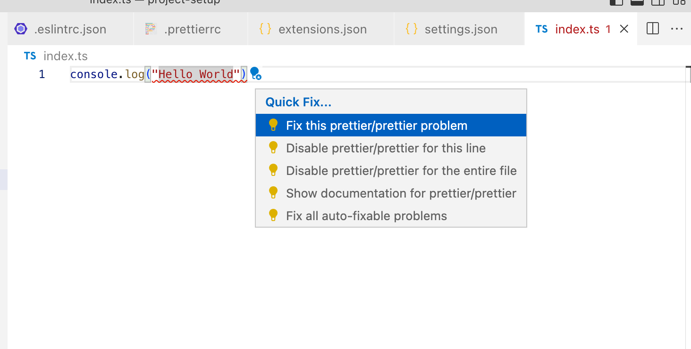
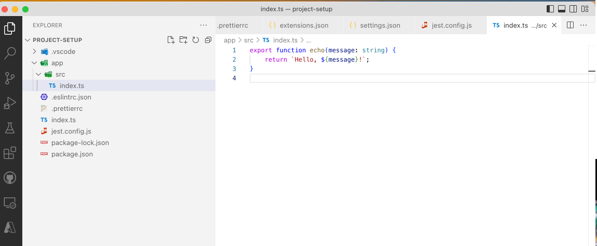
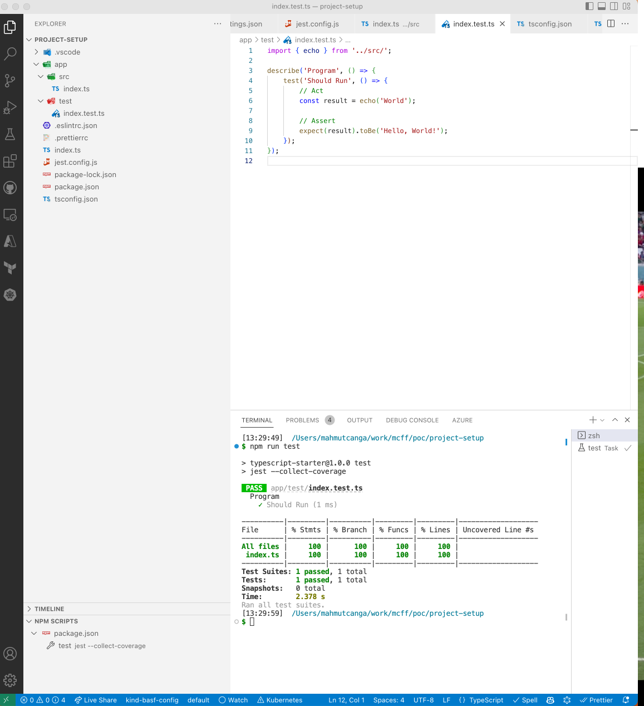

# Project Setup

This module goes over a typical NodeJS project setup using Typescript.

Overview:

- Start a new NodeJS project
- Initialize Typescript project
- Setup ESlint and Prettier
- Checkpoint: Automagically Fixing Issues
- Setup Testing
- Checkpoint: Write a hello world application

## Start New NodeJS Project

Starting a new NodeJS project can be achieved in many ways. A simple way could be running `npm init` and completing the inputs for the questions it asks:

```sh
npm init
```

This will output:

```sh
This utility will walk you through creating a package.json file.
It only covers the most common items, and tries to guess sensible defaults.

See `npm help init` for definitive documentation on these fields
and exactly what they do.

Use `npm install <pkg>` afterwards to install a package and
save it as a dependency in the package.json file.

Press ^C at any time to quit.
```

Answering the questions it asks:

```sh
package name: (project-setup) typescript-starter
version: (1.0.0) 
description: a starter project for learning and setting up projects
entry point: (index.js) 
test command: jest --collect-coverage
git repository: {YOU CAN SKIP THIS FOR NOW}
keywords: {YOU CAN SKIP THIS FOR NOW}
author: {YOUR NAME}
license: (ISC) MIT
```

This will output:

```sh
About to write to {YOUR-PROJECT-PATH}/package.json:

{
  "name": "typescript-starter",
  "version": "1.0.0",
  "description": "a starter project for learning and setting up projects",
  "main": "index.js",
  "scripts": {
    "test": "jest --collect-coverage"
  },
  "author": "Mahmut Canga",
  "license": "MIT"
}
```

At this point you will have a `package.json`. This file is used for overall project management for:

- Installing dependencies
- Running project commands (run, build, lint, test etc.)

## Initialize Typescript Project

For the upcoming modules, we will update the `package.json` to install Typescript as a package. Typescript can be installed as a global dependency too. For now, we are installing as a local dependency for this project only.

Add following to `package.json` after `scripts` section:

```json
"devDependencies": {
    "typescript": "^4.9.3"
},
```

To use a dependency added to `package.json`, you need to install them by running `npm install` at the root folder where `package.json` is located.

By convention, `npm` uses `dependencies` and `devDependencies` from `package.json`. The entries are key/value pairs pointing to a package name and its version from [Npm Registry](https://www.npmjs.com/). In above entry, we are telling `npm` to install version `4.9.3` of Typescript.

Usually `devDependencies` entry in `package.json` means a package is required for a developer during development and building the project. A `dependencies` entry in `package.json` means a package needs to function effectively not only for building the project but also running it.

Also, a caret(^) in `package.json` for a version (`^4.9.3`) means that we require `npm` to a **Compatible with version** to all future minor/patch versions, without incrementing the major version. So, `4.9.3` will use all releases from `4.9.3` to `5.0.0`.

Run following command at the root folder to install Typescript.

```sh
npm install
```

In addition to this, Typescript requires a configuration file to manage how it is transpiled into Javascript.
Create a new file `tsconfig.json` with following content:

```json
{
    "compilerOptions": {
        "target": "ES2018",
        "module": "commonjs",
        "lib": [
            "es2018"
        ],
        "declaration": true,
        "resolveJsonModule": true,
        "strict": true,
        "noImplicitAny": false,
        "strictNullChecks": true,
        "noImplicitThis": true,
        "alwaysStrict": true,
        "noUnusedLocals": false,
        "noUnusedParameters": false,
        "noImplicitReturns": true,
        "noFallthroughCasesInSwitch": false,
        "inlineSourceMap": false,
        "inlineSources": false,
        "experimentalDecorators": true,
        "strictPropertyInitialization": false,
        "esModuleInterop": true,
        "skipLibCheck": true,
        "sourceMap": true,
        "outDir": "build",
        "typeRoots": [
            "./node_modules/@types"
        ],
        "types": [
            "node",
            "jasmine",
            "mocha",
            "jest"
        ]
    },
    "include": [
        "**/*"
    ],
    "exclude": [
        "**/*.spec.ts",
        "./build/**/*",
        "docs"
    ]
}
```

Important details from the above configuration can be summarised as:

1. We are running ECMA Version 2018 for our Javascript. You can check what each version could bring as feature sets from [here](https://www.w3schools.com/js/js_versions.asp)
1. We import modules using `commonjs` conventions. CommonJS is a project with the goal to establish conventions on the module ecosystem for JavaScript outside of the web browser. CommonJS modules are the original way to package JavaScript code for Node.js. Node.js also supports the ECMAScript modules standard used by browsers and other JavaScript runtime. More details can be found [here](https://nodejs.org/docs/latest/api/modules.html)
1. We are not transpiling code for `build` folder and `docs` folder

There is so much configuration going on in this setup and it is recommended to follow what each configuration does from the [Typescript Docs](https://www.typescriptlang.org/docs/handbook/tsconfig-json.html).

`npm install` installs all the packages and its dependencies from [Npm Registry](https://www.npmjs.com/) and puts under `node_modules` folder. By convention, this folder is hidden from projects as well as source control.

Over the course of the project this `node_modules` folder could become quite big. There is a popular joke in Javascript community about what `npm install` does in the end.

> **Q: What are the top 3 heaviest objects in the universe from the lightest to the heaviest?**
>
> *A: They are:*
>
> 1. Sun
> 2. Neutron Star
> 3. Black Hole
> 4. node_modules Folder
>
> ¯\_(ツ)_/¯
>

However, `package-lock.json` as another artifact is usually kept in the source control. It is created for locking the dependencies with the installed version. It describes the exact tree that was generated, such that subsequent installs are able to generate identical trees, regardless of intermediate dependency updates. More details can be found on [the npm docs](https://docs.npmjs.com/files/package-lock.json).

## Setup ESLint and Prettier

[ESLint](https://eslint.org/) statically analyzes your code to quickly find problems. It is built into most text editors and you can run ESLint as part of your continuous integration pipeline. Many problems ESLint finds can be automatically fixed. ESLint fixes are syntax-aware so you won't experience errors introduced by traditional find-and-replace algorithms. ESLint has been critical in helping developers write high-quality Javascript and it catches common issues early and often. It enforces code quality, consistent code formatting rules and makes it easy to onboard new developers to the project.

[Prettier](https://prettier.io/) is an opinionated code formatter. Most text editors and IDEs support it so when you save the file, code is formatted automatically. This saves so much time discussing style in code reviews. It removes all original styling* and ensures that all outputted code conforms to a consistent style.

To install ESLint and Prettier, add following `devDependencies` to `package.json`:

```json
        "@typescript-eslint/eslint-plugin": "^5.44.0",
        "@typescript-eslint/parser": "^5.44.0",
        "eslint": "^8.28.0",
        "eslint-config-prettier": "^8.5.0",
        "eslint-config-standard-with-typescript": "^23.0.0",
        "eslint-plugin-import": "^2.26.0",
        "eslint-plugin-n": "^15.5.1",
        "eslint-plugin-prettier": "^4.2.1",
        "eslint-plugin-promise": "^6.1.1",
        "eslint-plugin-unused-imports": "^2.0.0",
        "prettier": "^2.8.0"

```

Also, both ESLint and Prettier requires configuration files to define the code style, formatting rules and code quality concerns.

### ESLint Setup

Create `.eslintrc.json` file with following content:

```json
{
    "root": true,
    "env": {
        "commonjs": true,
        "node": true,
        "jest": true
    },
    "parser": "@typescript-eslint/parser",
    "extends": [
        "plugin:@typescript-eslint/recommended",
        "prettier",
        "plugin:prettier/recommended"
    ],
    "parserOptions": {
        "ecmaVersion": 2018,
        "sourceType": "module"
    },
    "ignorePatterns": [
        "**/build",
        "**/node_modules"
    ],
    "plugins": ["unused-imports"],
    "rules": {
        "@typescript-eslint/array-type": [
            "error",
            {
                "default": "generic"
            }
        ],
        "@typescript-eslint/no-empty-interface": "off",
        "@typescript-eslint/explicit-module-boundary-types": "off",
        "@typescript-eslint/no-explicit-any": "error",
        "@typescript-eslint/no-inferrable-types": "error",
        "@typescript-eslint/no-var-requires": "off",
        "@typescript-eslint/no-non-null-assertion": "off",
        "@typescript-eslint/ban-ts-comment": "off",
        "curly": [
            "error",
            "multi-line"
        ],
        "indent": "off",
        "no-console": "off",
        "prefer-destructuring": "off",
        "max-len": "off",
        "object-curly-newline": "off",
        "implicit-arrow-linebreak": "off",
        "prefer-const": "error",
        "prettier/prettier": [
            "error",
            {
                "endOfLine": "auto"
            }
        ],
        "unused-imports/no-unused-imports": "error"
    }
}
```

Important details from the above configuration can be summarised as:

1. We need ESLint to remove any unused import statements. This means the final code will remove have any package or library imported that are not used
1. We need ESLint to parse and analyse our code using `typescript-eslint/parser`
1. We are using ECMA Version 2018 for our Javascript. You can check what each version could bring as feature sets from [here](https://www.w3schools.com/js/js_versions.asp)
1. We ignore running ESLint from `build` and `node_modules` folders

There is so much configuration going on in this ESLint setup and it is recommended to follow what each configuration does from the [ESLint Docs](https://eslint.org/docs/latest/).

### Prettier Setup

Create `.prettierrc` file with following content:

```json
{
    "arrowParens": "always",
    "bracketSpacing": true,
    "endOfLine": "lf",
    "htmlWhitespaceSensitivity": "css",
    "insertPragma": false,
    "jsxSingleQuote": false,
    "printWidth": 240,
    "proseWrap": "preserve",
    "quoteProps": "as-needed",
    "requirePragma": false,
    "semi": true,
    "singleQuote": true,
    "tabWidth": 4,
    "trailingComma": "es5",
    "useTabs": false,
    "vueIndentScriptAndStyle": false,
    "overrides": [
        {
          "files": ["*.mts", "*.cts", "*.ts"],
          "options": {
            "parser": "typescript"
          }
        }
      ]
}
```

Important details from the above configuration can be summarised as:

1. We use `typescript` parser on `"*.mts", "*.cts", "*.ts"` files to format the code
1. We set `printWidth` to 240. Usually all modern screens are wide enough to see most of the code in a single line and still easy to follow
1. We use `' (single quote)` by default for all strings
1. We use a `tabWidth` of 4 for nice formatting and easy to follow code style

### Editor Setup

Most IDEs support automatically applying ESLint and Prettier rules. In this guide, we will setup VSCode to automatically apply these rules on every file save. Also, VSCode will warn and issue problems on Problems tab when there is code violating the code, style and format.

Create `.vscode` folder and add following files:

`extensions.json` to install recommended extensions. Please also make sure these extensions are installed in your VSCode for the best experience.

```json
{
    "recommendations": [
        "dbaeumer.vscode-eslint",
        "chris-noring.node-snippets",
        "christian-kohler.npm-intellisense",
        "esbenp.prettier-vscode"
    ]
}
```

`settings.json` to run actions on VSCode:

```json
{
  "editor.codeActionsOnSave": {
    "source.fixAll.eslint": true
  },
  "editor.formatOnSave": true,
  "files.exclude": {
    "app/**/*.js": true,
    "app/**/*.js.map": true,
    "app/**/*.d.ts": true,
    "build": true,
  },
}
```

Important details from the above configuration can be summarised as:

1. We setup VSCode to fix all `eslint` issues automatically on saving a file
1. We format code on saving a file
1. We exclude these rules from non-typescript files

## ✅ Checkpoint: Automagically Fixing Issues

After setting all configuration files and packages, now install all dependencies:

```sh
npm install
```

Now create a file `index.ts` in the root folder with following content:

```typescript
console.log("Hello world")
```

When you are typing the above content (or copy/pasted), you should already see following errors highlighted on your editor:



Saving the file or selecting `Fix all auto-fixable problems`  should convert your code into following:

```typescript
console.log('Hello World');
```

You will realise that the double quotes (") are converted into single quotes (') and a semi-colon (;) is added to the end of the line.

🎉 From this point onwards, anyone in the project committing code will be writing consistent code while also getting quicker feedback for the possible issues with the code.

## Setup Testing

Testing is non-negotiable requirement for modern software development. Although there are different levels of testing, higher quality and quicker feedback comes from unit and integration testing. For these tests, we use one of the most established and mature testing libraries, [Jest](https://jestjs.io/).

Jest is a delightful JavaScript Testing Framework with a focus on simplicity. Tests are parallelized by running them in their own processes to maximize performance. Jest can generate code coverage by adding the flag --coverage. No additional setup needed. Jest can collect code coverage information from entire projects, including untested files. Jest also uses a custom resolver for imports in your tests, making it simple to mock any object outside of your test’s scope.

To setup Jest, we need to add following `devDependencies` to `package.json`:

```json
        "@types/jasmine": "^4.3.0",
        "@types/jest": "^29.2.3",
        "@types/mocha": "^10.0.0",
        "@types/node": "^18.11.9",
        "ts-jest": "^28.0.7",
        "ts-node": "^10.9.1",
```

Jest also requires a configuration file `jest.config.js` with following content:

```javascript
module.exports = {
    transform: {
        '^.+\\.ts?$': 'ts-jest',
    },
    testEnvironment: 'node',
    testRegex: './app/.*\\.(test|spec)?\\.(ts|ts)$',
    moduleFileExtensions: ['ts', 'tsx', 'js', 'jsx', 'json', 'node'],
    roots: ['<rootDir>/app'],
};
```

Important details from the above configuration can be summarised as:

1. We use `ts-jest` to transform Typescript files into Javascript files to run Jest effectively
1. We use Jest in `node` environment. This means the Javascript/Typescript we build will not rely on browsers and purely running on a NodeJS Server
1. We search for all files under `app` folder ending with `*.test.ts` or `*.spec.ts` for test code
1. We use `app` folder as the root for all source code

Now install all dependencies and set the environment:

```sh
npm install
```

## ✅ Checkpoint: Write a hello world application

At this point, we setup our code formatter, code style, analysers and testing framework. Now, we can write a hello world application that can bring all of it together.

Create a new file `index.ts` under `app/src` folder:



Let's write your first hello world program. This will be a single function NodeJS application which simply returns `Hello, World!` style message.

In `index.ts`, write your `echo` function:

```typescript
export function echo(message: string) {
    return `Hello, ${message}!`;
}
```

The above code **exports** `echo` function making it accessible publicly and importable by any other package in your program. It simply puts the message sent into a Template literals (Template strings).

Template literals are literals delimited with backtick (`) characters, allowing for multi-line strings, string interpolation with embedded expressions, and special constructs called tagged templates. Template literals are sometimes informally called template strings, because they are used most commonly for string interpolation (to create strings by doing substitution of placeholders).

At this point, there is actually just a simple function but not a complete program. However, it is still testable and can provide us if our setup is working as a feedback.

Let's write your first test. This will be under a folder called `test`. This is just a common convention and doesn't provide any runtime benefits. It is for the benefit of code reader. Technically, the test file can be anywhere under `app` folder. However, it is a better practice to separate test code from source code for maintainability and developer productivity.

Under `__test__` folder, let's create the first test `index.test.ts` with following content:

```typescript
import { echo } from '../src';

describe('Program', () => {
    test('Should Run', () => {
        // Act
        const result = echo('World');

        // Assert
        expect(result).toBe('Hello, World!');
    });
});
```

Important details from the above code snippet can be summarised as:

1. We are importing `echo` from `src` folder. Because our file called `index.ts`, by convention we don't need to specify the exact path as `../src/index.ts`.
1. We are grouping all tests in this file under a single `describe` method. This is a Jest convention. describe(name, fn) creates a block that groups together several related tests.
1. Our main test logic goes under `test` block.
1. We assert the result of the test using `expect` block.

When you run following command in root folder, you should be seeing the test running:

```sh
npm run test
```

It will output:

```sh
> typescript-starter@1.0.0 test
> jest --collect-coverage

 PASS  app/test/index.test.ts
  Program
    ✓ Should Run (1 ms)

----------|---------|----------|---------|---------|-------------------
File      | % Stmts | % Branch | % Funcs | % Lines | Uncovered Line #s 
----------|---------|----------|---------|---------|-------------------
All files |     100 |      100 |     100 |     100 |                   
 index.ts |     100 |      100 |     100 |     100 |                   
----------|---------|----------|---------|---------|-------------------
Test Suites: 1 passed, 1 total
Tests:       1 passed, 1 total
Snapshots:   0 total
Time:        2.378 s
Ran all test suites.
```

You can also run the same command from `NPM Scripts` tab on your editor as VSCode recognizes all script runners from `package.json`.



The above command completed couple of things:

1. Transpiled code into Javascript using `jest.config.js` configurations
1. Searched for all files with `*.test.ts` or `*.spec.ts` convention
1. Executed all tests in parallel
1. Collected code coverage. This is under `coverage` folder and ignored in source control.

🎉 From this point onwards, you can develop a TDD application, run unit and integration tests and collect code coverage for building a modern application.
