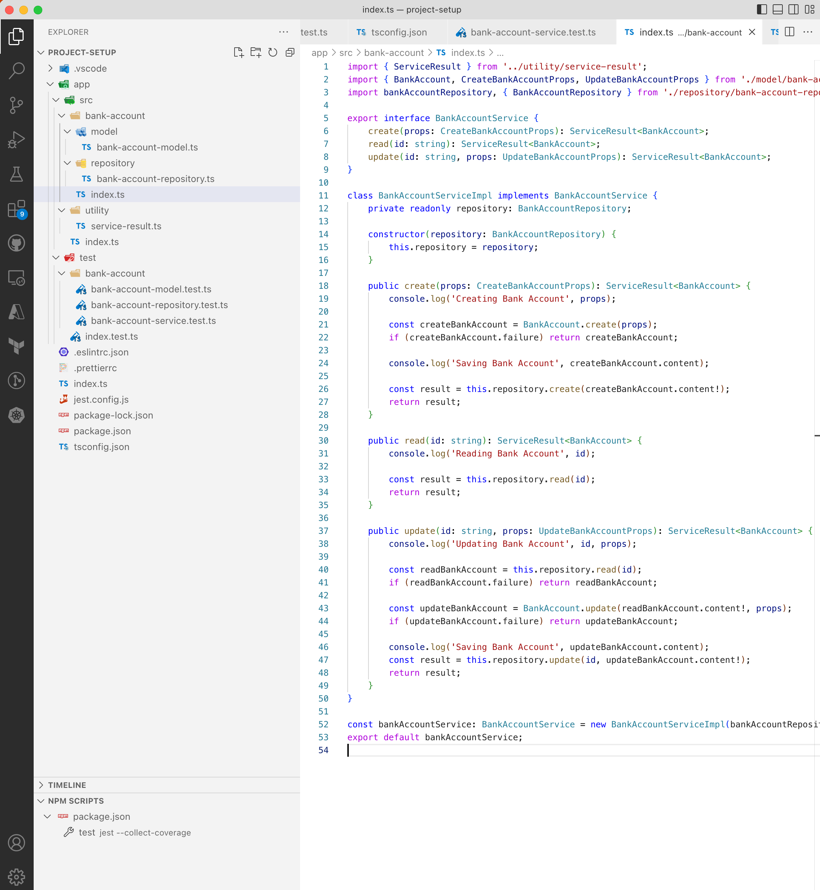

# Servicing Domain Model

Up until this point, we have built the core business logic inside our domain model and implemented a repository for saving and modifying the data.

To enable this domain exposed to other parts of the application as a service, we can introduce the last piece of the puzzle, Service Layer.

A service layer is usually an abstraction of a controller. It knows which subparts of the domain to coordinate to achieve a business goal. It is not coupled to a certain technology or medium so the deployment model, or the underlying infrastructure, of the application do not affect the service.

## Designing Service Layer

From the core domain model, we can expose following main functionalities.

- Create Bank Account
- Retrieve Bank Account
- Update Bank Account

Because these functionalities are exposed as a contract, whether we consume this service as a CLI, as a REST API or simply inside another service, none of the underlying changes of the service should affect the rest of the application. This loosely coupling not only achieves great flexibility, but also great testability.

Create `index.ts` file just under `app/src/bank-account` folder with following:

```typescript
import { ServiceResult } from '../utility/service-result';
import { BankAccount, CreateBankAccountProps, UpdateBankAccountProps } from './model/bank-account-model';

export interface BankAccountService {
    create(props: CreateBankAccountProps): ServiceResult<BankAccount>;
    read(id: string): ServiceResult<BankAccount>;
    update(id: string, props: UpdateBankAccountProps): ServiceResult<BankAccount>;
}
```

Exposing our service from `index.ts` has multiple benefits.

First of all, this is `npm` compatible. So, if we ever need to publish `bank-account` service as a package, the conventions will be ready.

Secondly, when our service is imported, it is neatly abstracted without exposing too much details:

```typescript
import bankAccountService from '../src/bank-account';
```

Another benefit is exposing our service as a contract and not concrete implementation. If we ever require to use different repository or underlying subparts of our service for different configurations, we can achieve this like below:

```typescript
import { ServiceResult } from '../utility/service-result';
import { BankAccount, CreateBankAccountProps, UpdateBankAccountProps } from './model/bank-account-model';

export interface BankAccountService {
    create(props: CreateBankAccountProps): ServiceResult<BankAccount>;
    read(id: string): ServiceResult<BankAccount>;
    update(id: string, props: UpdateBankAccountProps): ServiceResult<BankAccount>;
}

let bankAccountService: BankAccountService;

if (process.env.ENVIRONMENT === 'local') {
    bankAccountService = new LocalBankAccountServiceImpl();
} else {
    bankAccountService = new BankAccountServiceImpl();
}

export default bankAccountService;
```

For our example, let's implement our `BankAccountService` using `BankAccountRepository`.
This also means that, `BankAccountService` will depend on `BankAccountRepository`. When it comes to testability and clean design, a dependency is best injected at the constructor level, when object is created, so the intentions of the object is made clear to the outside world.

We can achieve this by implementing the `BankAccountService` like below:

```typescript
import { ServiceResult } from '../utility/service-result';
import { BankAccount, CreateBankAccountProps, UpdateBankAccountProps } from './model/bank-account-model';
import bankAccountRepository, { BankAccountRepository } from './repository/bank-account-repository';

export interface BankAccountService {
    create(props: CreateBankAccountProps): ServiceResult<BankAccount>;
    read(id: string): ServiceResult<BankAccount>;
    update(id: string, props: UpdateBankAccountProps): ServiceResult<BankAccount>;
}

class BankAccountServiceImpl implements BankAccountService {
    private readonly repository: BankAccountRepository;

    constructor(repository: BankAccountRepository) {
        this.repository = repository;
    }

    public create(props: CreateBankAccountProps): ServiceResult<BankAccount> {
        throw new Error('Method not implemented.');
    }

    public read(id: string): ServiceResult<BankAccount> {
        throw new Error('Method not implemented.');
    }

    public update(id: string, props: UpdateBankAccountProps): ServiceResult<BankAccount> {
        throw new Error('Method not implemented.');
    }
}

const bankAccountService: BankAccountService = new BankAccountServiceImpl(bankAccountRepository);
export default bankAccountService;
```

Let's unbundle couple of concepts from the above code.

We are implementing our service with `BankAccountRepository` dependency. We design our implementation to inject this dependency at the object creation, constructor, by implementing below:

```typescript
class BankAccountServiceImpl implements BankAccountService {
    private readonly repository: BankAccountRepository;

    constructor(repository: BankAccountRepository) {
        this.repository = repository;
    }
    
    //////
}
```

This makes sure that during runtime, nothing can change `repository: BankAccountRepository` dependency.
However, we are injecting this dependency as a contract, `interface BankAccountRepository` and not concrete implementation. This is helpful for many concerns like testing and modularity of the application.

To inject a dependency at object creation, we need to import the dependency and pass to the constructor. We are achieving this by following:

```typescript
import bankAccountRepository, { BankAccountRepository } from './repository/bank-account-repository';

//////

class BankAccountServiceImpl implements BankAccountService {
    private readonly repository: BankAccountRepository;

    constructor(repository: BankAccountRepository) {
        this.repository = repository;
    }
    
    //////
}

const bankAccountService: BankAccountService = new BankAccountServiceImpl(bankAccountRepository);
export default bankAccountService;
```

Now we make sure that `BankAccountService` is exposed the way we designed and not open for any modifications.
When another part of the app is imported the service, all dependencies and concerns will be imported too and ready to run.

## Testing The Dependencies

When it comes to testing the dependencies of an implementation, there are different school of thoughts. Mocking the dependency and injecting it at the object creation is a common example. However, Jest provides another way of doing this with the concept called `Spy`. It is similar to runtime reflection in other programming languages. At its core, during the runtime, just before the method or object is called, Jest is able to interrupt it and can run an arbitrary code, mock etc.

A simple test spying on `create` method of `bankAccountRepository` can be implemented like below:

```typescript
import { randomUUID } from 'crypto';
import bankAccountService from '../../src/bank-account';
import { BankAccount, CreateBankAccountProps } from '../../src/bank-account/model/bank-account-model';
import bankAccountRepository from '../../src/bank-account/repository/bank-account-repository';

describe('Bank Account Service', () => {
    let createSpy: jest.SpyInstance;

    beforeEach(() => {
        createSpy = jest.spyOn(bankAccountRepository, 'create');
    });

    afterEach(() => {
        createSpy.mockRestore();
    });

    test('Should Create', () => {
        // Arrange
        const owner = randomUUID();
        const accountName = 'Test Account';

        const props: CreateBankAccountProps = {
            name: accountName,
            owner,
        };

        const createExpectedBankAccount = BankAccount.create(props);

        repositorySpy.mockReturnValue(createExpectedBankAccount);

        // Act
        const createBankAccount = bankAccountService.create(props);
        const bankAccount = createBankAccount.content!;

        // Assert
        expect(bankAccount).not.toBeNull();
        expect(bankAccount?.balance).toBe(0);
        expect(bankAccount?.owner).toBe(createExpectedBankAccount.content!.owner);
        expect(bankAccount?.accountNumber).toBe(createExpectedBankAccount.content!.accountNumber);
        expect(bankAccount?.sortCode).toBe(createExpectedBankAccount.content!.sortCode);
        expect(bankAccount?.name).toBe(accountName);
        expect(bankAccount?.welcomeMessage).toBe(createExpectedBankAccount.content?.accountNumber);
        expect(bankAccount?.id).toBe(createExpectedBankAccount.content!.id);
        expect(bankAccount?.sortCode.length).toBe(6);
        expect(bankAccount?.accountNumber.length).toBe(8);
    });
});
```

Here we are first creating a `jest.SpyInstance`:

```typescript
let createSpy: jest.SpyInstance;
```

Then before each test, we are initializing the spy on `create` method:

```typescript
beforeEach(() => {
    createSpy = jest.spyOn(bankAccountRepository, 'create');
});
```

So, every time when this method is called, we can return a mock response:

```typescript
createSpy.mockReturnValue(createExpectedBankAccount);
```

Also, at the end of the test run, we are restoring the mock (garbage collecting), so undesired side effects are mitigated:

```typescript
afterEach(() => {
    createSpy.mockRestore();
});
```

## ✅ Checkpoint: Let's Implement Service

Paste following content to `bank-account-service.test.ts`:

```typescript
import { randomUUID } from 'crypto';
import bankAccountService from '../../src/bank-account';
import { BankAccount, CreateBankAccountProps } from '../../src/bank-account/model/bank-account-model';
import bankAccountRepository from '../../src/bank-account/repository/bank-account-repository';

describe('Bank Account Service', () => {
    let createSpy: jest.SpyInstance;
    let updateSpy: jest.SpyInstance;
    let readSpy: jest.SpyInstance;

    beforeEach(() => {
        createSpy = jest.spyOn(bankAccountRepository, 'create');
        updateSpy = jest.spyOn(bankAccountRepository, 'update');
        readSpy = jest.spyOn(bankAccountRepository, 'read');
    });

    afterEach(() => {
        createSpy.mockRestore();
        updateSpy.mockRestore();
        readSpy.mockRestore();
    });

    test('Should Create', () => {
        // Arrange
        const owner = randomUUID();
        const accountName = 'Test Account';

        const props: CreateBankAccountProps = {
            name: accountName,
            owner,
        };

        const createExpectedBankAccount = BankAccount.create(props);

        createSpy.mockReturnValue(createExpectedBankAccount);

        // Act
        const createBankAccount = bankAccountService.create(props);
        const bankAccount = createBankAccount.content!;

        // Assert
        expect(bankAccount).not.toBeNull();
        expect(bankAccount?.balance).toBe(0);
        expect(bankAccount?.owner).toBe(createExpectedBankAccount.content!.owner);
        expect(bankAccount?.accountNumber).toBe(createExpectedBankAccount.content!.accountNumber);
        expect(bankAccount?.sortCode).toBe(createExpectedBankAccount.content!.sortCode);
        expect(bankAccount?.name).toBe(accountName);
        expect(bankAccount?.welcomeMessage).toBe(createExpectedBankAccount.content?.welcomeMessage);
        expect(bankAccount?.id).toBe(createExpectedBankAccount.content!.id);
        expect(bankAccount?.sortCode.length).toBe(6);
        expect(bankAccount?.accountNumber.length).toBe(8);
    });

    test('Should Update', () => {
        // Arrange
        const owner = randomUUID();
        const accountName = 'Test Account';

        const props: CreateBankAccountProps = {
            name: accountName,
            owner,
        };

        const createExpectedBankAccount = BankAccount.create(props);
        readSpy.mockReturnValue(createExpectedBankAccount);
        createSpy.mockReturnValue(createExpectedBankAccount);

        const createBankAccount = bankAccountService.create(props);

        const updateProps = {
            name: 'Updated Account Name',
        };

        const updatedExpectedBankAccount = BankAccount.update(createBankAccount.content!, updateProps);
        updateSpy.mockReturnValue(updatedExpectedBankAccount);

        // Act
        const bankAccount = bankAccountService.update(createBankAccount.content!.id, updateProps).content!;

        // Assert
        expect(bankAccount).not.toBeNull();
        expect(bankAccount?.balance).toBe(0);
        expect(bankAccount?.owner).toBe(createExpectedBankAccount.content!.owner);
        expect(bankAccount?.accountNumber).toBe(createExpectedBankAccount.content!.accountNumber);
        expect(bankAccount?.sortCode).toBe(createExpectedBankAccount.content!.sortCode);
        expect(bankAccount?.name).toBe(updateProps.name);
        expect(bankAccount?.welcomeMessage).toBe(createExpectedBankAccount.content?.welcomeMessage);
        expect(bankAccount?.id).toBe(createExpectedBankAccount.content!.id);
        expect(bankAccount?.sortCode.length).toBe(6);
        expect(bankAccount?.accountNumber.length).toBe(8);
    });
});
```

Paste the following content to `index.ts` under `app/src/bank-account`:

```typescript
import { ServiceResult } from '../utility/service-result';
import { BankAccount, CreateBankAccountProps, UpdateBankAccountProps } from './model/bank-account-model';
import bankAccountRepository, { BankAccountRepository } from './repository/bank-account-repository';

export interface BankAccountService {
    create(props: CreateBankAccountProps): ServiceResult<BankAccount>;
    read(id: string): ServiceResult<BankAccount>;
    update(id: string, props: UpdateBankAccountProps): ServiceResult<BankAccount>;
}

class BankAccountServiceImpl implements BankAccountService {
    private readonly repository: BankAccountRepository;

    constructor(repository: BankAccountRepository) {
        this.repository = repository;
    }

    public create(props: CreateBankAccountProps): ServiceResult<BankAccount> {
        console.log('Creating Bank Account', props);

        const createBankAccount = BankAccount.create(props);
        if (createBankAccount.failure) return createBankAccount;

        console.log('Saving Bank Account', createBankAccount.content);

        const result = this.repository.create(createBankAccount.content!);
        return result;
    }

    public read(id: string): ServiceResult<BankAccount> {
        console.log('Reading Bank Account', id);

        const result = this.repository.read(id);
        return result;
    }

    public update(id: string, props: UpdateBankAccountProps): ServiceResult<BankAccount> {
        console.log('Updating Bank Account', id, props);

        const readBankAccount = this.repository.read(id);
        if (readBankAccount.failure) return readBankAccount;

        const updateBankAccount = BankAccount.update(readBankAccount.content!, props);
        if (updateBankAccount.failure) return updateBankAccount;

        console.log('Saving Bank Account', updateBankAccount.content);
        const result = this.repository.update(id, updateBankAccount.content!);
        return result;
    }
}

const bankAccountService: BankAccountService = new BankAccountServiceImpl(bankAccountRepository);
export default bankAccountService;
```

🎉 Running tests using `npm run test` or via NPM Scripts on the UI will give following test result:

```typescript
---------------|---------|----------|---------|---------|-------------------
File           | % Stmts | % Branch | % Funcs | % Lines | Uncovered Line #s 
---------------|---------|----------|---------|---------|-------------------
All files      |   84.26 |    73.68 |   94.11 |    87.2 |                   
 src           |     100 |      100 |     100 |     100 |                   
  index.ts     |     100 |      100 |     100 |     100 |                   
 ...nk-account |      76 |        0 |      75 |   86.36 |                   
  index.ts     |      76 |        0 |      75 |   86.36 | 31-34             
 ...ount/model |     100 |      100 |     100 |     100 |                   
  ...-model.ts |     100 |      100 |     100 |     100 |                   
 ...repository |   70.37 |        0 |     100 |   70.37 |                   
  ...sitory.ts |   70.37 |        0 |     100 |   70.37 | ...45-47,61,71-73 
 src/utility   |     100 |      100 |     100 |     100 |                   
  ...result.ts |     100 |      100 |     100 |     100 |                   
---------------|---------|----------|---------|---------|-------------------

Test Suites: 4 passed, 4 total
Tests:       11 passed, 11 total
Snapshots:   0 total
Time:        1.815 s, estimated 2 s
Ran all test suites.
```

Final view of the codebase should look like this:

